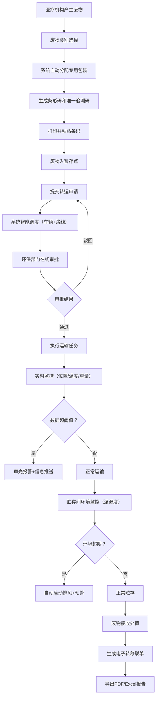

## 1. 产品概述

医疗废物智慧管理桌面系统是一款面向医疗机构、运输企业、处置厂和环保监管部门的一体化管理平台，实现医疗废物从产生、收集、转运、贮存到处置的全流程数字化、智能化、可追溯管理。系统通过物联网、大数据和可视化技术，解决医疗废物管理中存在的追溯难、调度乱、监控弱、报告繁等痛点，确保医疗废物安全合规处置。

## 2. 核心功能

### 2.1 用户角色

| 角色 | 注册方式 | 核心权限 |
|------|----------|----------|
| 医疗机构操作员 | 系统分配账号 | 废物登记、转运申请、数据查看 |
| 运输调度员 | 系统分配账号 | 车辆调度、路线规划、运输监控 |
| 环保审批员 | 系统分配账号 | 转运审批、预警处理、监管统计 |
| 处置厂操作员 | 系统分配账号 | 废物接收、处置确认、联单生成 |
| 系统管理员 | 系统分配账号 | 用户管理、参数配置、系统维护 |

### 2.2 功能模块

1. **工作台**: 数据概览、预警提醒、快捷操作入口
2. **废物登记管理**: 废物类别登记、自动包装分配、条形码打印、追溯码生成
3. **转运调度中心**: 转运申请、智能调度、路线优化、在线审批
4. **运输实时监控**: 车辆定位、温湿度监控、重量监测、声光报警
5. **贮存环境监控**: 温湿度采集、排风控制、预警通知、历史记录
6. **电子联单管理**: 转移联单生成、联单查询、PDF/Excel导出
7. **统计分析报告**: 月度运营报告、数据统计、图表分析
8. **可视化地图**: 废物热力分布、运输轨迹回放、实时态势展示
9. **系统设置**: 用户管理、基础数据配置、阈值参数设置

### 2.3 页面详情

| 页面名称 | 模块名称 | 功能描述 |
|----------|----------|----------|
| 工作台 | 数据概览卡片 | 展示今日登记量、待转运量、在途车辆、预警数量等关键指标 |
| 工作台 | 预警列表 | 实时展示温度超限、重量异常、设备故障等预警信息 |
| 工作台 | 快捷操作 | 快速进入登记、申请、监控等核心功能 |
| 废物登记 | 废物类别选择 | 感染性、损伤性、病理性、化学性、药物性废物分类选择 |
| 废物登记 | 自动包装分配 | 根据废物类别自动匹配专用包装袋/利器盒规格 |
| 废物登记 | 条形码生成 | 自动生成并打印唯一条形码，粘贴于包装物 |
| 废物登记 | 追溯码生成 | 生成包含废物全生命周期信息的唯一追溯码 |
| 转运申请 | 申请单填写 | 填写废物种类、数量、暂存点信息 |
| 转运申请 | 智能调度算法 | 根据暂存容量、车辆状态、处置能力自动推荐最优方案 |
| 转运申请 | 路线规划 | 基于地图和交通状况自动规划最优运输路线 |
| 转运审批 | 待办列表 | 展示待审批的转运申请单 |
| 转运审批 | 在线审批 | 环保部门在线审核、批准或驳回 |
| 运输监控 | 车辆列表 | 展示所有运输车辆的基本信息和实时状态 |
| 运输监控 | 实时数据面板 | 显示车辆位置、箱体温度、重量、行驶速度等实时数据 |
| 运输监控 | 报警管理 | 超阈值自动触发声光报警，推送异常信息 |
| 贮存监控 | 环境数据面板 | 实时展示各贮存间温湿度数据 |
| 贮存监控 | 设备控制 | 超限自动启动排风设备，支持手动控制 |
| 贮存监控 | 预警通知 | 生成并推送环境超限预警通知 |
| 电子联单 | 联单列表 | 展示所有转移联单，支持多条件筛选 |
| 电子联单 | 联单详情 | 查看联单完整信息，支持在线签章 |
| 电子联单 | 报告导出 | 导出PDF格式联单和Excel月度运营报告 |
| 可视化地图 | 热力分布 | 以热力图形式展示各医疗机构废物产生分布 |
| 可视化地图 | 运输轨迹 | 实时展示车辆位置，支持历史轨迹回放 |
| 可视化地图 | 态势展示 | 标注暂存点、处置厂、运输路线等全局态势 |
| 系统设置 | 用户管理 | 用户增删改查、角色权限分配 |
| 系统设置 | 基础数据 | 医疗机构、车辆、包装规格等基础数据配置 |
| 系统设置 | 阈值配置 | 温度、湿度、重量等报警阈值参数设置 |

## 3. 核心流程

## 4. 用户界面设计

### 4.1 设计风格

- **主色调**: 医疗蓝 (#0066CC) 作为主色，体现专业、可信、科技感
- **辅助色**: 警示红 (#E53935) 用于报警提示，安全绿 (#43A047) 用于正常状态，预警橙 (#FB8C00) 用于提醒
- **背景色**: 深灰蓝 (#1A2332) 作为深色主题背景，降低视觉疲劳，适合长时间监控使用
- **卡片背景**: 半透明深蓝 (#253142) 配合微妙边框，增强层次感
- **按钮风格**: 圆角矩形按钮，主按钮采用渐变蓝，悬停有微妙光泽效果，点击有下沉反馈
- **字体**: 标题使用 "Noto Sans SC" 粗体，正文使用 "PingFang SC" 常规体，数字使用等宽字体 "JetBrains Mono" 增强数据可读性
- **布局风格**: 左侧导航栏 + 顶部状态栏 + 右侧内容区的经典桌面应用布局，采用卡片式模块组织，信息密度适中
- **图标风格**: 线性轮廓图标，统一2px描边，与整体简洁专业风格匹配

### 4.2 页面设计概述

| 页面名称 | 模块名称 | UI 元素 |
|----------|----------|----------|
| 工作台 | 数据概览 | 渐变数据卡片、实时数字跳动动画、图标+数值+趋势箭头组合 |
| 工作台 | 预警列表 | 时间线布局、不同级别预警对应不同颜色标签、闪烁动画提示新预警 |
| 废物登记 | 表单区域 | 分类标签页切换、废物类别卡片选择器、动态表单字段 |
| 废物登记 | 条码预览 | 实时生成的条形码和二维码预览区、打印按钮动效 |
| 转运调度 | 调度面板 | 车辆状态卡片（颜色区分空闲/在途/维护）、路线地图预览 |
| 运输监控 | 实时面板 | 大尺寸数字仪表、温湿度曲线图、车辆状态指示灯 |
| 运输监控 | 报警弹窗 | 醒目红色边框、闪烁动画、声音播放按钮、处理操作按钮 |
| 贮存监控 | 环境面板 | 仪表盘样式温湿度显示、设备开关状态切换、历史趋势曲线 |
| 可视化地图 | 地图区域 | 全屏地图、热力图层、车辆移动标记点动画、轨迹线条 |
| 电子联单 | 联单预览 | 仿真纸质联单样式、电子签章区域、下载按钮 |

### 4.3 响应式设计

- 桌面优先设计，适配 1920×1080 及以上分辨率
- 支持窗口缩放，内容区域自适应调整
- 左侧导航栏可折叠，提供更大内容展示空间
- 表格支持水平滚动，适配多列数据展示
- 关键监控面板支持全屏展示模式

### 4.4 动效设计

- 页面加载：元素从下往上渐入，卡片依次出现（stagger 动画）
- 数据更新：数字变化时采用平滑过渡动画
- 报警提示：红色边框脉冲动画 + 轻微抖动效果
- 车辆移动：地图上车辆标记点平滑位移动画
- 按钮交互：悬停上移 2px + 阴影加深，点击下沉反馈
- 模态框：背景模糊 + 缩放进入动画
