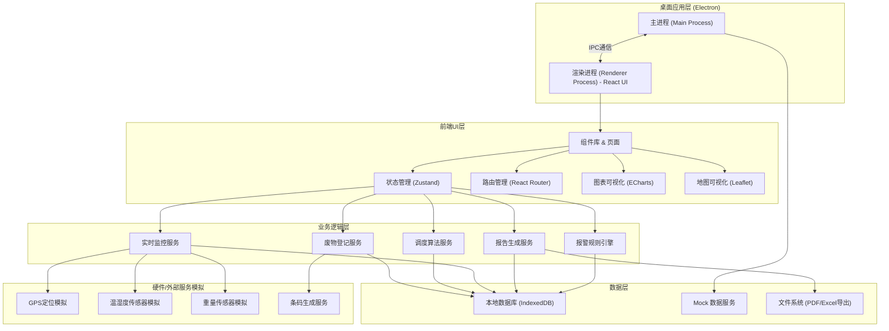
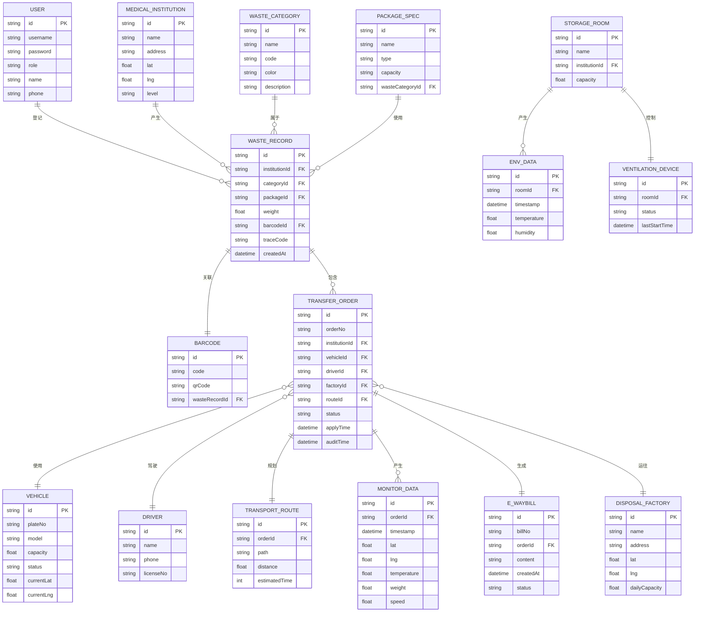

## 1. 架构设计



## 2. 技术描述

### 2.1 核心技术栈

- **桌面框架**: Electron@28 - 跨平台桌面应用框架，提供系统级API访问
- **前端框架**: React@18 + TypeScript@5 - 组件化开发，类型安全
- **构建工具**: Vite@5 - 快速构建和热更新
- **样式方案**: TailwindCSS@3 + SCSS - 原子化CSS配合自定义样式
- **状态管理**: Zustand@4 - 轻量级状态管理，支持持久化
- **路由管理**: React Router@6 - 单页应用路由
- **图表库**: ECharts@5 - 数据可视化图表
- **地图库**: Leaflet@1.9 + OpenStreetMap - 地图可视化
- **条码生成**: JsBarcode + qrcode.react - 条形码和二维码生成
- **PDF导出**: jspdf + html2canvas - PDF文档生成
- **Excel导出**: xlsx (SheetJS) - Excel文件生成
- **本地存储**: IndexedDB (Dexie.js) - 本地大数据存储
- **动画库**: Framer Motion - 流畅的交互动画
- **UI组件**: 自定义组件库 + Headless UI - 无样式组件配合自定义样式

### 2.2 目录结构

```
medical-waste-system/
├── electron/                    # Electron 主进程
│   ├── main.ts                 # 主进程入口
│   ├── preload.ts              # 预加载脚本
│   └── ipc/                    # IPC通信模块
├── src/                         # React 渲染进程
│   ├── assets/                 # 静态资源
│   │   ├── fonts/              # 字体文件
│   │   ├── icons/              # 图标资源
│   │   └── images/             # 图片资源
│   ├── components/             # 通用组件
│   │   ├── ui/                 # 基础UI组件
│   │   ├── layout/             # 布局组件
│   │   └── charts/             # 图表组件
│   ├── pages/                  # 页面组件
│   │   ├── Dashboard/          # 工作台
│   │   ├── WasteRegistration/  # 废物登记
│   │   ├── TransportDispatch/  # 转运调度
│   │   ├── TransportMonitor/   # 运输监控
│   │   ├── StorageMonitor/     # 贮存监控
│   │   ├── EWaybill/           # 电子联单
│   │   ├── VisualMap/          # 可视化地图
│   │   └── Settings/           # 系统设置
│   ├── store/                  # 状态管理
│   │   ├── useWasteStore.ts
│   │   ├── useTransportStore.ts
│   │   ├── useMonitorStore.ts
│   │   └── useUserStore.ts
│   ├── services/               # 业务服务
│   │   ├── wasteService.ts
│   │   ├── transportService.ts
│   │   ├── monitorService.ts
│   │   ├── reportService.ts
│   │   └── barcodeService.ts
│   ├── types/                  # TypeScript 类型定义
│   │   ├── waste.ts
│   │   ├── transport.ts
│   │   ├── monitor.ts
│   │   └── user.ts
│   ├── utils/                  # 工具函数
│   │   ├── mock.ts             # Mock数据
│   │   ├── format.ts           # 格式化工具
│   │   ├── algorithm.ts        # 调度算法
│   │   └── export.ts           # 导出工具
│   ├── db/                     # 本地数据库
│   │   └── index.ts            # Dexie 配置
│   ├── hooks/                  # 自定义 Hooks
│   ├── styles/                 # 全局样式
│   │   ├── index.scss
│   │   ├── variables.scss
│   │   └── animations.scss
│   ├── App.tsx                 # 根组件
│   ├── main.tsx                # 入口文件
│   └── router.tsx              # 路由配置
├── public/                     # 公共资源
├── package.json
├── tsconfig.json
├── vite.config.ts
├── electron-builder.yml        # 打包配置
└── tailwind.config.js
```

## 3. 路由定义

| 路由路径 | 页面名称 | 模块说明 |
|----------|----------|----------|
| /dashboard | 工作台 | 数据概览、预警提醒、快捷操作 |
| /waste-registration | 废物登记 | 废物类别选择、自动包装分配、条码生成 |
| /transport-dispatch | 转运调度 | 转运申请、智能调度、在线审批 |
| /transport-monitor | 运输监控 | 车辆列表、实时数据、报警管理 |
| /storage-monitor | 贮存监控 | 环境数据、设备控制、预警通知 |
| /ewaybill | 电子联单 | 联单列表、详情查看、导出功能 |
| /visual-map | 可视化地图 | 热力分布、运输轨迹、态势展示 |
| /settings/users | 用户管理 | 用户增删改查、权限分配 |
| /settings/basic-data | 基础数据 | 医疗机构、车辆、包装配置 |
| /settings/threshold | 阈值配置 | 报警阈值参数设置 |

## 4. 数据模型

### 4.1 ER 图



### 4.2 数据字典

#### 废物类别 (WASTE_CATEGORY)
| ID | 名称 | 代码 | 颜色 | 说明 |
|----|------|------|------|------|
| INFECTIOUS | 感染性废物 | INF | #E53935 | 携带病原微生物具有引发感染性疾病传播危险 |
| INJURY | 损伤性废物 | INJ | #FB8C00 | 能够刺伤或者割伤人体的废弃的医用锐器 |
| PATHOLOGICAL | 病理性废物 | PAT | #7B1FA2 | 诊疗过程中产生的人体废弃物和医学实验动物尸体 |
| CHEMICAL | 化学性废物 | CHE | #1976D2 | 具有毒性、腐蚀性、易燃易爆性的废弃的化学物品 |
| DRUG | 药物性废物 | DRU | #388E3C | 过期、淘汰、变质或者被污染的废弃的药品 |

#### 包装规格 (PACKAGE_SPEC)
| 废物类别 | 包装类型 | 规格 |
|----------|----------|------|
| 感染性 | 专用包装袋 | 黄色、25L/50L/100L |
| 感染性 | 周转箱 | 黄色、60L/100L |
| 损伤性 | 利器盒 | 黄色、1L/3L/5L/10L |
| 病理性 | 专用包装袋 | 黄色、50L/100L |
| 化学性 | 专用密封桶 | 蓝色、20L/50L |
| 药物性 | 专用包装袋 | 红色、25L/50L |

#### 转运单状态 (TRANSFER_ORDER.status)
- `DRAFT`: 草稿
- `PENDING_AUDIT`: 待审批
- `APPROVED`: 已批准
- `REJECTED`: 已驳回
- `IN_TRANSIT`: 运输中
- `ARRIVED`: 已到达
- `COMPLETED`: 已完成

#### 车辆状态 (VEHICLE.status)
- `IDLE`: 空闲
- `IN_TRANSIT`: 运输中
- `MAINTENANCE`: 维护中
- `DISABLED`: 停用

## 5. 核心算法

### 5.1 智能调度算法

根据以下因素进行车辆调度优化：
1. **暂存点容量利用率** = 当前存量 / 最大容量
2. **车辆可用状态**：筛选空闲且在有效期内的车辆
3. **车辆载重匹配**：车辆载重 ≥ 待转运重量
4. **运输距离最短**：使用两点之间直线距离估算
5. **处置厂接收能力**：当前处置量 / 日处理能力 < 0.9

调度优先级计算公式：
```
优先级 = 0.4 * (1 - 车辆空闲时间占比) + 0.3 * (1 - 距离归一化值) + 0.3 * 暂存点容量利用率
```

### 5.2 追溯码生成规则

追溯码结构（32位）：
```
[机构编码:6位][类别编码:3位][日期:8位][流水号:10位][校验位:5位]
```

示例：`MED001-INF-20240115-0000000001-XXXXX`

### 5.3 报警规则引擎

| 监控项 | 阈值范围 | 报警级别 | 响应动作 |
|--------|----------|----------|----------|
| 箱体温度 | > 8°C | 严重 | 声光报警 + 推送 |
| 箱体温度 | 5-8°C | 警告 | 信息推送 |
| 重量偏差 | ±5% | 警告 | 信息记录 |
| 重量偏差 | ±10% | 严重 | 声光报警 + 推送 |
| 贮存温度 | > 25°C | 严重 | 自动排风 + 报警 |
| 贮存湿度 | > 80% | 警告 | 自动排风 + 提醒 |

## 6. 模拟数据设计

系统启动时自动生成以下模拟数据：
- 20家医疗机构（含坐标位置）
- 5家处置厂（含坐标位置）
- 15辆运输车辆（含实时位置模拟）
- 100条废物登记记录
- 30条转运订单
- 实时监控数据流（每3秒更新一次）
- 环境传感器数据流（每5秒更新一次）

## 7. 技术约束

- 不依赖任何后端服务，所有数据存储于本地 IndexedDB
- 地图使用 OpenStreetMap 离线瓦片或模拟地图
- 所有硬件传感器数据通过模拟服务生成
- 导出功能使用客户端库实现，无需服务端支持
- 使用 Mock 数据实现完整业务流程演示
